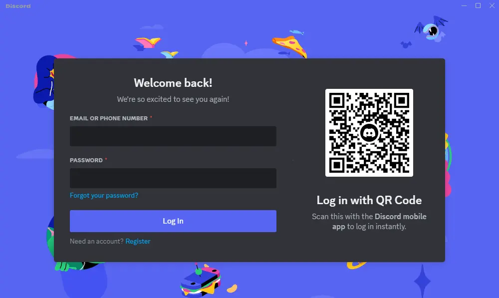
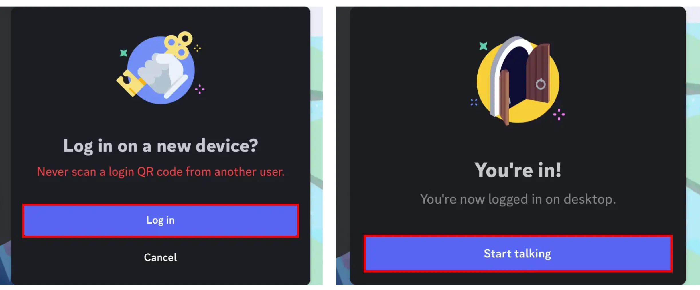

# Resumen

La autenticación remota es una función que permite la transferencia sencilla de credenciales de un dispositivo a otro. Si bien oficialmente esto se utiliza para autenticar clientes de Discord de escritorio usando un cliente móvil de Discord ya autenticado, es útil cuando quieres iniciar sesión en un dispositivo que no tiene teclado o pantalla, como un reloj inteligente o una televisión inteligente.

## Cómo funciona

El funcionamiento del proceso de autenticación es bastante simple. El cliente que desea autenticarse (denominado "escritorio") se conecta a una pasarela especial de autenticación remota (remote auth Gateway) y realiza un intercambio de claves. La pasarela eventualmente responde con un valor que puede mostrarse en un código QR, para que el dispositivo autenticado (denominado "móvil") lo escanee:

<figure><figcaption></figcaption></figure>

Cuando se escanea el código QR, el cliente móvil envía una solicitud para iniciar el proceso de autenticación. El cliente de escritorio entonces recibe la información del usuario del cliente móvil. Una vez realizado esto, el usuario puede verificar y aceptar o rechazar la solicitud de autenticación en el cliente móvil. Si el usuario acepta la solicitud, el cliente de escritorio recibe el token de autorización del usuario.

<figure><figcaption></figcaption></figure>

## Cómo se usa

Para comenzar a usar la autenticación remota, puedes asumir el rol de cliente de escritorio o de cliente móvil. El cliente de escritorio es el que desea autenticarse, y el cliente móvil es el que se utilizará para verificar la solicitud de autenticación.

Para información detallada sobre el cliente de escritorio, consulta la sección de escritorio. Para más detalles sobre el cliente móvil, visita la sección móvil.
